# 电子日历业务流程图文档

## 一、文档概述

本文档详细描述了电子日历系统的核心业务流程，包括用户注册、登录、日程管理、任务管理和家庭共享等。通过清晰的流程图，帮助开发团队理解业务逻辑和数据流向，确保开发的系统符合业务需求。

## 二、流程图符号说明

| 符号 | 名称 | 描述 |
|------|------|------|
| 🔶 | 开始/结束 | 流程的起点或终点 |
| 🟦 | 流程步骤 | 具体的业务操作 |
| ⬜ | 决策点 | 需要判断的条件 |
| ⬜ | 子流程 | 可调用的子流程 |
| ➡️ | 流向箭头 | 流程的执行方向 |

## 三、核心业务流程图

### 1. 用户注册流程

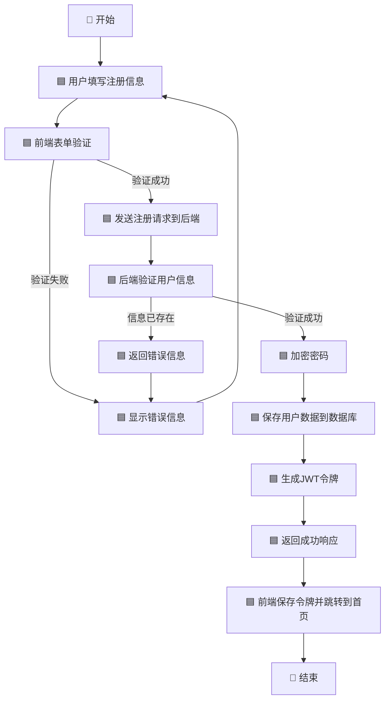

### 2. 用户登录流程

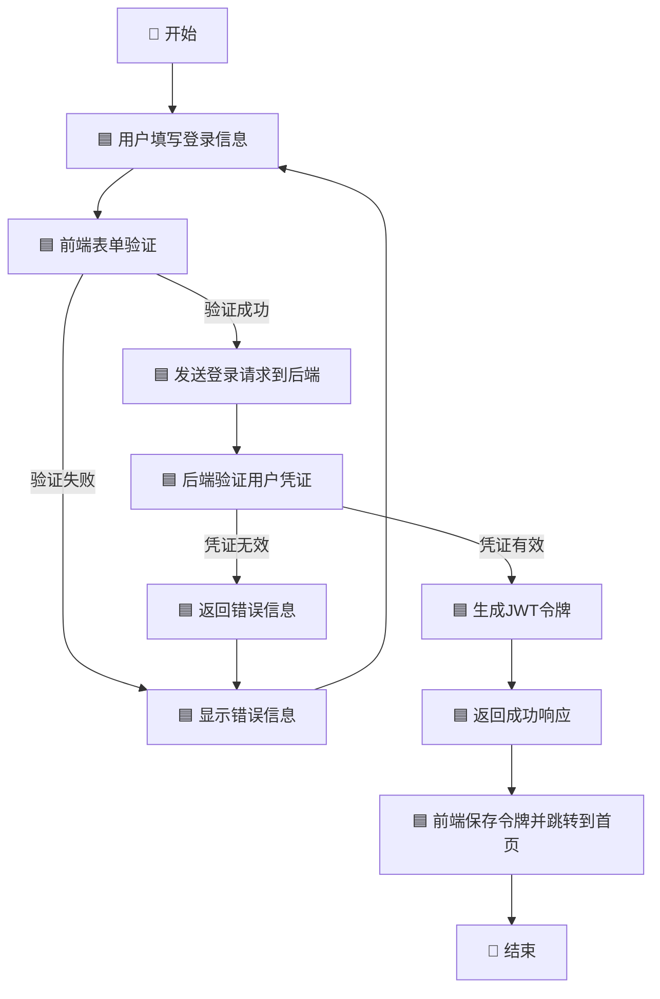

### 3. 日程管理流程

#### 3.1 创建日程流程


#### 3.2 编辑日程流程

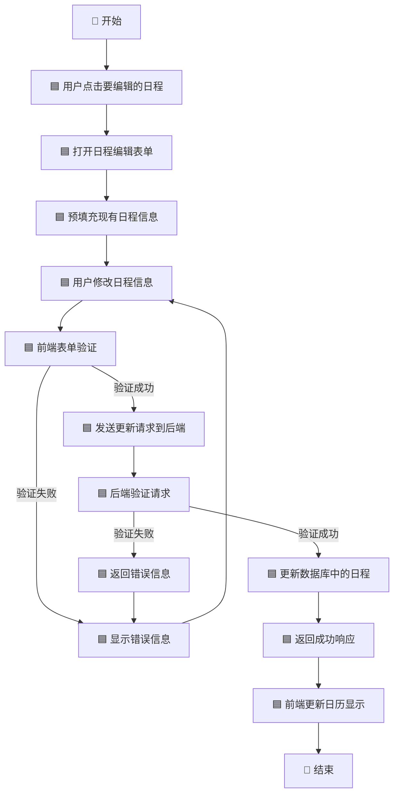

#### 3.3 删除日程流程

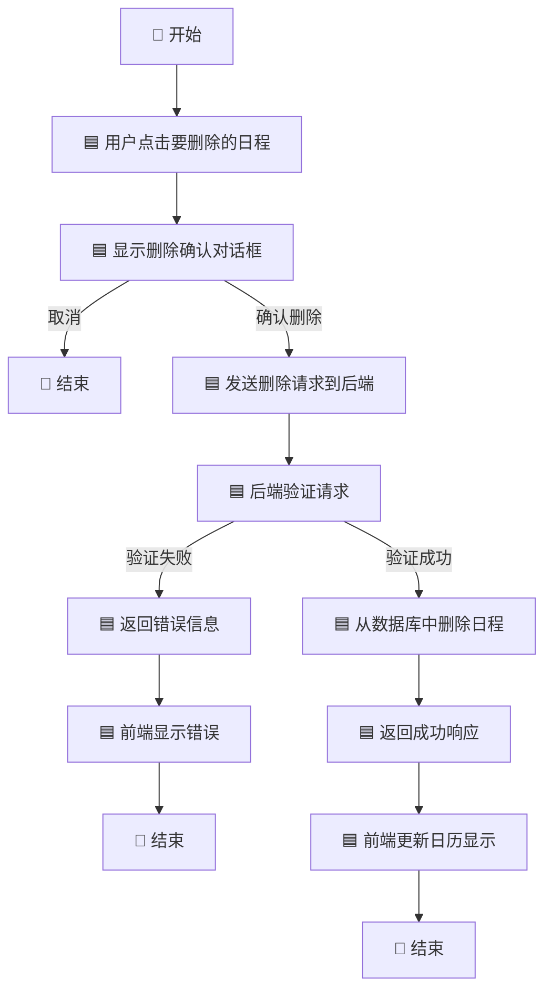

### 4. 任务管理流程

#### 4.1 创建任务流程

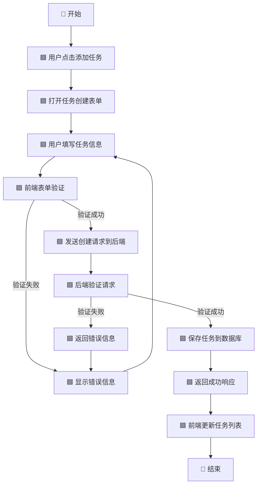

#### 4.2 标记任务完成/未完成流程

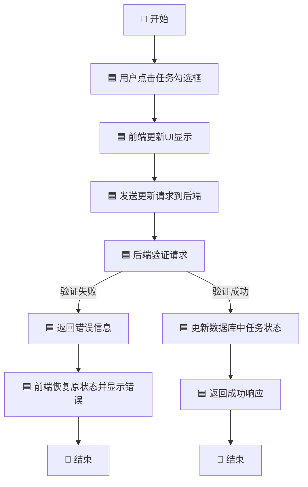

#### 4.3 任务审批流程

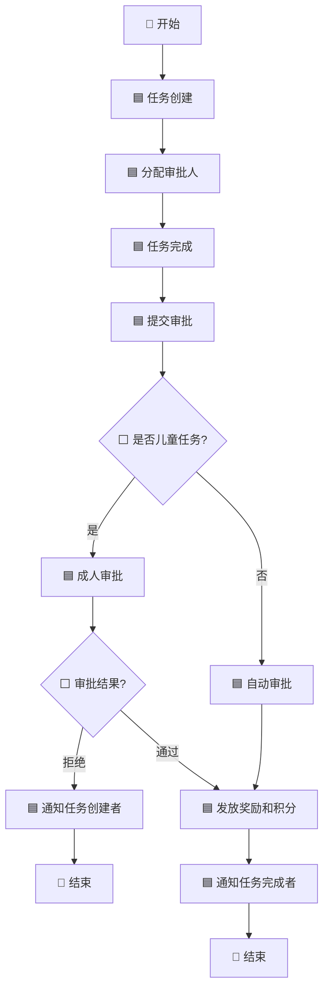

### 5. 家庭共享流程

#### 5.1 创建家庭组流程

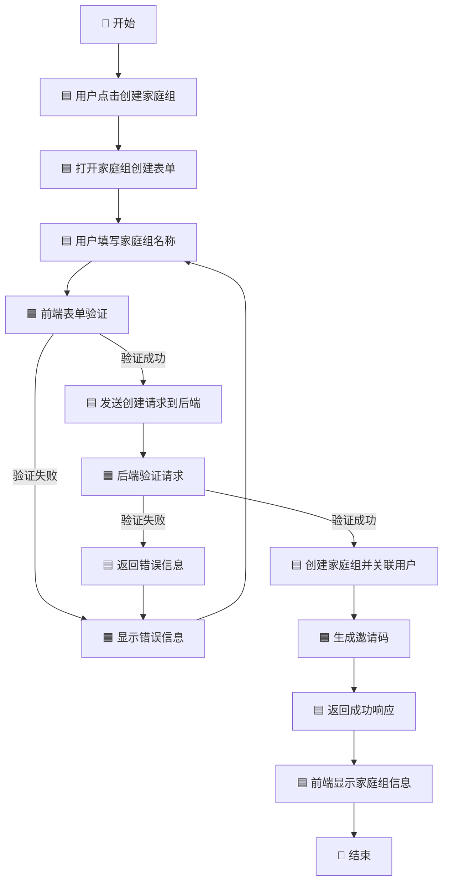

#### 5.2 邀请家庭成员流程

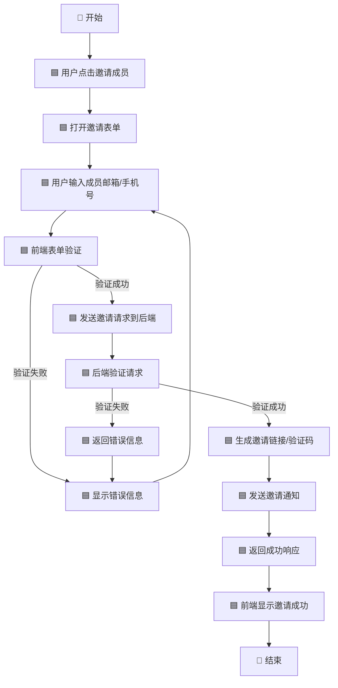

#### 5.3 共享日程流程

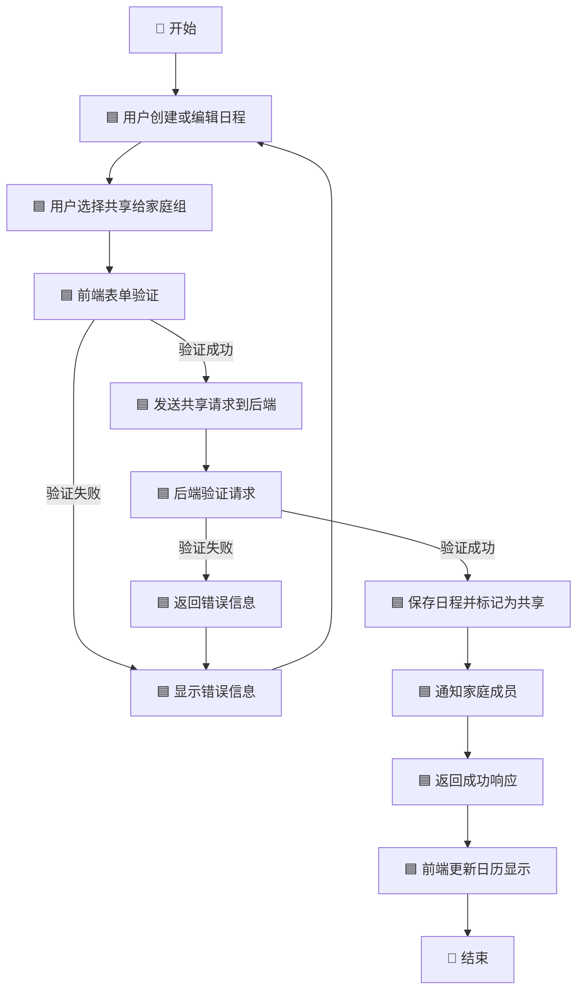

### 6. 日历视图切换流程

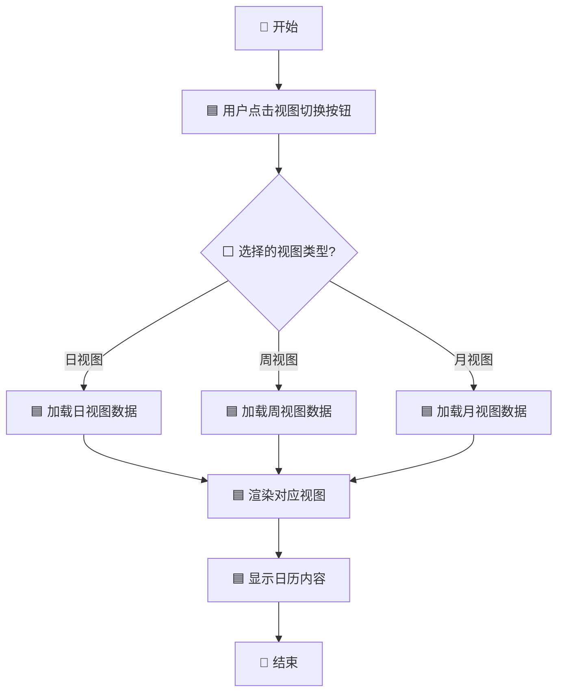

### 7. 积分管理流程

#### 7.1 积分获取流程

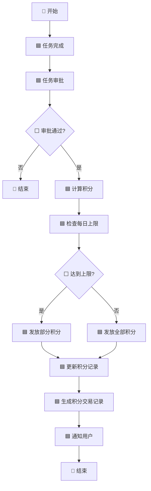

#### 7.2 积分兑换流程

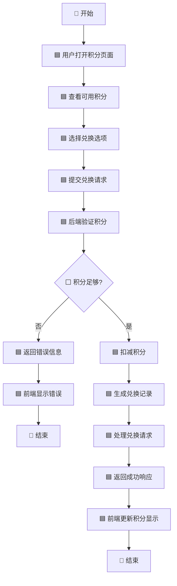

## 四、数据流向图

### 1. 系统整体数据流向

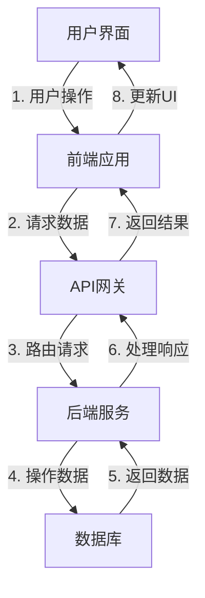

### 2. 日程数据流向

```mermaid
flowchart TD
    A[用户创建日程] --> B[前端表单验证]
    B --> C[发送POST请求到/api/events]
    C --> D[后端验证JWT]
    D --> E[后端处理数据]
    E --> F[保存到MongoDB events集合]
    F --> G[返回成功响应]
    G --> H[前端更新日历]
    H --> I[用户查看日程]
    I --> J[发送GET请求到/api/events/{date}]
    J --> K[后端验证JWT]
    K --> L[查询数据库]
    L --> M[返回日程列表]
    M --> N[前端渲染日程]
```

### 3. 任务数据流向

```mermaid
flowchart TD
    A[用户添加任务] --> B[前端表单验证]
    B --> C[发送POST请求到/api/tasks]
    C --> D[后端验证JWT]
    D --> E[后端处理数据]
    E --> F[保存到MongoDB tasks集合]
    F --> G[返回成功响应]
    G --> H[前端更新任务列表]
    H --> I[用户标记任务完成]
    I --> J[发送PUT请求到/api/tasks/{id}/toggle]
    J --> K[后端验证JWT]
    K --> L[更新数据库中任务状态]
    L --> M[返回成功响应]
    M --> N[前端更新任务显示]
    N --> O[用户提交审批]
    O --> P[发送POST请求到/api/tasks/{id}/approve]
    P --> Q[后端验证JWT]
    Q --> R[更新任务审批状态]
    R --> S[检查是否需要审批]
    S --> T[处理奖励和积分]
    T --> U[返回成功响应]
    U --> V[前端更新任务显示]
```

### 4. 积分数据流向

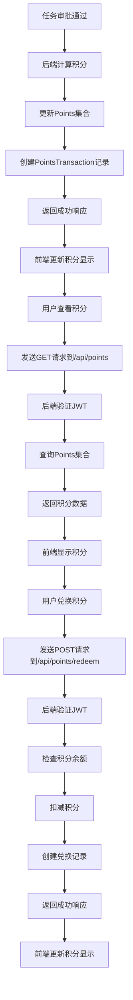

## 五、流程优化建议

1. **异步处理**：对于非关键路径的操作（如发送通知），建议使用异步处理，提高系统响应速度
2. **缓存策略**：对于频繁访问的数据（如日历视图数据），建议添加缓存机制，减少数据库查询
3. **批量操作**：支持批量创建/更新/删除日程和任务，提高用户操作效率
4. **离线支持**：添加离线操作功能，允许用户在无网络情况下继续使用核心功能，网络恢复后自动同步
5. **预加载数据**：预加载即将访问的数据，减少用户等待时间
6. **错误重试机制**：对于网络请求失败的情况，添加自动重试机制，提高系统可靠性

## 六、总结

本业务流程图文档详细描述了电子日历系统的核心业务流程和数据流向，包括用户注册登录、日程管理、任务管理、家庭共享、日历视图切换，以及新增的任务审批和积分管理流程。这些流程图为开发团队提供了清晰的业务逻辑指导，确保系统实现符合业务需求，提供良好的用户体验。

新增的任务审批流程支持儿童任务的成人审批机制，确保任务完成的真实性和合理性。积分管理流程则实现了积分的获取、查询和兑换功能，为用户提供了更多的激励机制。

随着业务的发展，流程图可能需要不断更新和优化，建议定期审查和更新本文档，以适应新的业务需求和技术变化。